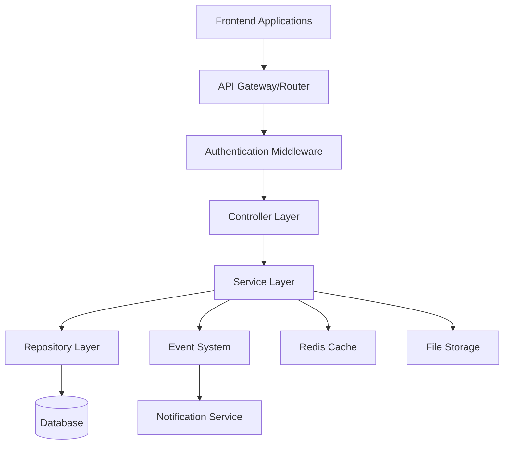

# FleetFlow Backend Design Document

## Overview

The FleetFlow backend is designed as a RESTful API service that provides comprehensive fleet and logistics management capabilities. The system follows a layered architecture with clear separation of concerns, implementing domain-driven design principles to handle complex business logic around vehicle management, trip dispatching, and financial tracking.

The backend will serve as the central hub for all fleet operations, providing real-time status management, role-based access control, and comprehensive analytics capabilities.

## Architecture

### High-Level Architecture



### Technology Stack

- **Runtime**: Node.js with TypeScript
- **Framework**: Express.js with middleware architecture
- **Database**: PostgreSQL for relational data integrity
- **Authentication**: JWT tokens with role-based permissions
- **File Storage**: Local filesystem or cloud storage for reports

## Components and Interfaces

### 1. Authentication & Authorization Module

**Purpose**: Manages user authentication, session handling, and role-based access control.

**Key Components**:
- `AuthController`: Handles login, logout, password reset endpoints
- `AuthService`: Business logic for authentication and token management
- `RoleMiddleware`: Express middleware for route protection
- `JWTService`: Token generation and validation utilities

**Interfaces**:
```typescript
interface User {
  id: string;
  email: string;
  role: UserRole;
  createdAt: Date;
  updatedAt: Date;
}

interface AuthTokenPayload {
  userId: string;
  role: UserRole;
  exp: number;
}

enum UserRole {
  FLEET_MANAGER = 'fleet_manager',
  DISPATCHER = 'dispatcher',
  SAFETY_OFFICER = 'safety_officer',
  FINANCIAL_ANALYST = 'financial_analyst'
}
```

### 2. Vehicle Management Module

**Purpose**: Handles CRUD operations for vehicles and real-time status management.

**Key Components**:
- `VehicleController`: REST endpoints for vehicle operations
- `VehicleService`: Business logic for vehicle lifecycle management
- `VehicleRepository`: Data access layer for vehicle entities
- `VehicleStatusService`: Real-time status tracking and validation

**Interfaces**:
```typescript
interface Vehicle {
  id: string;
  name: string;
  model: string;
  licensePlate: string; // Unique identifier
  maxLoadCapacity: number; // in kg
  currentOdometer: number;
  vehicleType: VehicleType;
  status: VehicleStatus;
  region?: string;
  createdAt: Date;
  updatedAt: Date;
}

enum VehicleStatus {
  AVAILABLE = 'available',
  ON_TRIP = 'on_trip',
  IN_SHOP = 'in_shop',
  OUT_OF_SERVICE = 'out_of_service'
}

enum VehicleType {
  TRUCK = 'truck',
  VAN = 'van',
  BIKE = 'bike'
}
```

### 3. Trip Management Module

**Purpose**: Manages trip lifecycle from creation to completion with validation rules.

**Key Components**:
- `TripController`: REST endpoints for trip operations
- `TripService`: Business logic for trip validation and state management
- `DispatchService`: Logic for vehicle and driver assignment
- `TripRepository`: Data persistence for trip entities

**Interfaces**:
```typescript
interface Trip {
  id: string;
  vehicleId: string;
  driverId: string;
  cargoWeight: number;
  origin: string;
  destination: string;
  status: TripStatus;
  scheduledDate: Date;
  completedDate?: Date;
  finalOdometer?: number;
  createdAt: Date;
  updatedAt: Date;
}

enum TripStatus {
  DRAFT = 'draft',
  DISPATCHED = 'dispatched',
  COMPLETED = 'completed',
  CANCELLED = 'cancelled'
}
```

### 4. Driver Management Module

**Purpose**: Handles driver profiles, compliance tracking, and performance metrics.

**Key Components**:
- `DriverController`: REST endpoints for driver operations
- `DriverService`: Business logic for compliance and performance tracking
- `ComplianceService`: License validation and expiry monitoring
- `DriverRepository`: Data access for driver entities

**Interfaces**:
```typescript
interface Driver {
  id: string;
  name: string;
  email: string;
  licenseNumber: string;
  licenseExpiry: Date;
  licenseCategory: string;
  status: DriverStatus;
  safetyScore: number;
  tripCompletionRate: number;
  createdAt: Date;
  updatedAt: Date;
}

enum DriverStatus {
  ON_DUTY = 'on_duty',
  OFF_DUTY = 'off_duty',
  SUSPENDED = 'suspended'
}
```

### 5. Maintenance Management Module

**Purpose**: Tracks vehicle maintenance and service history with automatic status updates.

**Key Components**:
- `MaintenanceController`: REST endpoints for maintenance operations
- `MaintenanceService`: Business logic for maintenance scheduling and tracking
- `MaintenanceRepository`: Data persistence for maintenance records

**Interfaces**:
```typescript
interface MaintenanceRecord {
  id: string;
  vehicleId: string;
  serviceType: string;
  description: string;
  cost: number;
  serviceDate: Date;
  completedDate?: Date;
  status: MaintenanceStatus;
  createdAt: Date;
  updatedAt: Date;
}

enum MaintenanceStatus {
  SCHEDULED = 'scheduled',
  IN_PROGRESS = 'in_progress',
  COMPLETED = 'completed'
}
```

### 6. Financial Management Module

**Purpose**: Tracks expenses, fuel consumption, and generates financial analytics.

**Key Components**:
- `ExpenseController`: REST endpoints for expense tracking
- `FuelService`: Fuel consumption and efficiency calculations
- `FinancialAnalyticsService`: ROI and cost analysis
- `ExpenseRepository`: Data persistence for financial records

**Interfaces**:
```typescript
interface FuelRecord {
  id: string;
  vehicleId: string;
  tripId?: string;
  liters: number;
  cost: number;
  fuelDate: Date;
  odometerReading: number;
  createdAt: Date;
}

interface FinancialMetrics {
  vehicleId: string;
  totalFuelCost: number;
  totalMaintenanceCost: number;
  totalOperationalCost: number;
  fuelEfficiency: number; // km/L
  costPerKm: number;
  roi?: number;
}
```

## Data Models

### Database Schema Design

The system uses PostgreSQL with the following key tables and relationships:

```sql
-- Core entity tables
CREATE TABLE users (
  id UUID PRIMARY KEY DEFAULT gen_random_uuid(),
  email VARCHAR(255) UNIQUE NOT NULL,
  password_hash VARCHAR(255) NOT NULL,
  role VARCHAR(50) NOT NULL,
  created_at TIMESTAMP DEFAULT NOW(),
  updated_at TIMESTAMP DEFAULT NOW()
);

CREATE TABLE vehicles (
  id UUID PRIMARY KEY DEFAULT gen_random_uuid(),
  name VARCHAR(255) NOT NULL,
  model VARCHAR(255) NOT NULL,
  license_plate VARCHAR(50) UNIQUE NOT NULL,
  max_load_capacity INTEGER NOT NULL,
  current_odometer INTEGER NOT NULL DEFAULT 0,
  vehicle_type VARCHAR(50) NOT NULL,
  status VARCHAR(50) NOT NULL DEFAULT 'available',
  region VARCHAR(100),
  created_at TIMESTAMP DEFAULT NOW(),
  updated_at TIMESTAMP DEFAULT NOW()
);

CREATE TABLE drivers (
  id UUID PRIMARY KEY DEFAULT gen_random_uuid(),
  name VARCHAR(255) NOT NULL,
  email VARCHAR(255) UNIQUE NOT NULL,
  license_number VARCHAR(100) NOT NULL,
  license_expiry DATE NOT NULL,
  license_category VARCHAR(50) NOT NULL,
  status VARCHAR(50) NOT NULL DEFAULT 'off_duty',
  safety_score DECIMAL(3,2) DEFAULT 0.00,
  trip_completion_rate DECIMAL(5,2) DEFAULT 0.00,
  created_at TIMESTAMP DEFAULT NOW(),
  updated_at TIMESTAMP DEFAULT NOW()
);

CREATE TABLE trips (
  id UUID PRIMARY KEY DEFAULT gen_random_uuid(),
  vehicle_id UUID NOT NULL REFERENCES vehicles(id),
  driver_id UUID NOT NULL REFERENCES drivers(id),
  cargo_weight INTEGER NOT NULL,
  origin VARCHAR(255) NOT NULL,
  destination VARCHAR(255) NOT NULL,
  status VARCHAR(50) NOT NULL DEFAULT 'draft',
  scheduled_date TIMESTAMP NOT NULL,
  completed_date TIMESTAMP,
  final_odometer INTEGER,
  created_at TIMESTAMP DEFAULT NOW(),
  updated_at TIMESTAMP DEFAULT NOW()
);

CREATE TABLE maintenance_records (
  id UUID PRIMARY KEY DEFAULT gen_random_uuid(),
  vehicle_id UUID NOT NULL REFERENCES vehicles(id),
  service_type VARCHAR(255) NOT NULL,
  description TEXT,
  cost DECIMAL(10,2) NOT NULL,
  service_date TIMESTAMP NOT NULL,
  completed_date TIMESTAMP,
  status VARCHAR(50) NOT NULL DEFAULT 'scheduled',
  created_at TIMESTAMP DEFAULT NOW(),
  updated_at TIMESTAMP DEFAULT NOW()
);

CREATE TABLE fuel_records (
  id UUID PRIMARY KEY DEFAULT gen_random_uuid(),
  vehicle_id UUID NOT NULL REFERENCES vehicles(id),
  trip_id UUID REFERENCES trips(id),
  liters DECIMAL(8,2) NOT NULL,
  cost DECIMAL(10,2) NOT NULL,
  fuel_date TIMESTAMP NOT NULL,
  odometer_reading INTEGER NOT NULL,
  created_at TIMESTAMP DEFAULT NOW()
);
```

### Indexes and Constraints

```sql
-- Performance indexes
CREATE INDEX idx_vehicles_status ON vehicles(status);
CREATE INDEX idx_vehicles_type ON vehicles(vehicle_type);
CREATE INDEX idx_drivers_status ON drivers(status);
CREATE INDEX idx_trips_status ON trips(status);
CREATE INDEX idx_trips_vehicle_driver ON trips(vehicle_id, driver_id);
CREATE INDEX idx_fuel_records_vehicle ON fuel_records(vehicle_id);
CREATE INDEX idx_maintenance_vehicle ON maintenance_records(vehicle_id);

-- Business rule constraints
ALTER TABLE trips ADD CONSTRAINT chk_cargo_weight_positive CHECK (cargo_weight > 0);
ALTER TABLE vehicles ADD CONSTRAINT chk_max_capacity_positive CHECK (max_load_capacity > 0);
ALTER TABLE fuel_records ADD CONSTRAINT chk_liters_positive CHECK (liters > 0);
ALTER TABLE fuel_records ADD CONSTRAINT chk_cost_positive CHECK (cost > 0);
```

## Error Handling

### Error Response Format

All API errors follow a consistent format:

```typescript
interface ApiError {
  error: {
    code: string;
    message: string;
    details?: any;
    timestamp: string;
  };
}
```

### Error Categories

1. **Validation Errors (400)**: Invalid input data, business rule violations
2. **Authentication Errors (401)**: Invalid credentials, expired tokens
3. **Authorization Errors (403)**: Insufficient permissions for requested action
4. **Not Found Errors (404)**: Requested resource doesn't exist
5. **Conflict Errors (409)**: Business logic conflicts (e.g., vehicle already assigned)
6. **Server Errors (500)**: Unexpected system errors

### Business Logic Error Handling

```typescript
class BusinessLogicError extends Error {
  constructor(
    public code: string,
    public message: string,
    public statusCode: number = 400
  ) {
    super(message);
  }
}

// Example usage
if (cargoWeight > vehicle.maxLoadCapacity) {
  throw new BusinessLogicError(
    'CARGO_EXCEEDS_CAPACITY',
    `Cargo weight ${cargoWeight}kg exceeds vehicle capacity ${vehicle.maxLoadCapacity}kg`,
    400
  );
}
```

## Testing Strategy

### Unit Testing

- **Controllers**: Test HTTP request/response handling and validation
- **Services**: Test business logic and error conditions
- **Repositories**: Test data access patterns and query logic
- **Utilities**: Test helper functions and calculations

### Integration Testing

- **API Endpoints**: Test complete request flows with database
- **Business Workflows**: Test multi-step processes (trip creation, maintenance scheduling)
- **Authentication**: Test role-based access control across endpoints

### Test Data Management

```typescript
// Test fixtures for consistent test data
export const testVehicle: Partial<Vehicle> = {
  name: 'Test Van',
  model: 'Ford Transit',
  licensePlate: 'TEST-001',
  maxLoadCapacity: 1000,
  vehicleType: VehicleType.VAN,
  status: VehicleStatus.AVAILABLE
};

export const testDriver: Partial<Driver> = {
  name: 'Test Driver',
  email: 'test@example.com',
  licenseNumber: 'DL123456',
  licenseExpiry: new Date('2025-12-31'),
  licenseCategory: 'B',
  status: DriverStatus.ON_DUTY
};
```

### Performance Testing

- **Load Testing**: Simulate concurrent users accessing the system
- **Database Performance**: Test query performance with large datasets
- **Real-time Updates**: Test status change propagation under load

The testing strategy ensures reliability and maintainability while supporting the complex business logic requirements of fleet management operations.